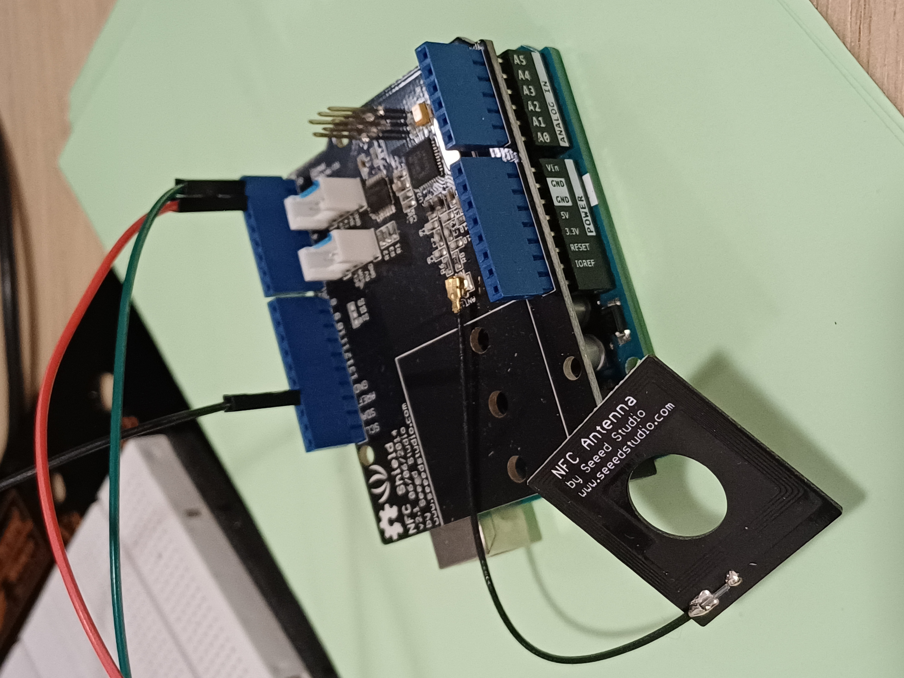
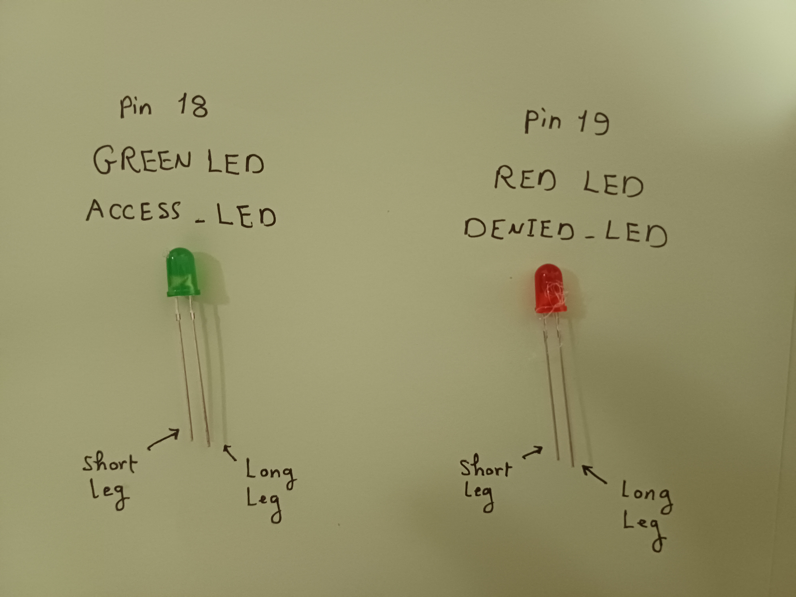
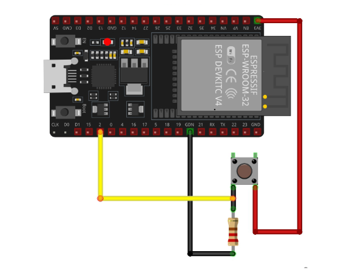
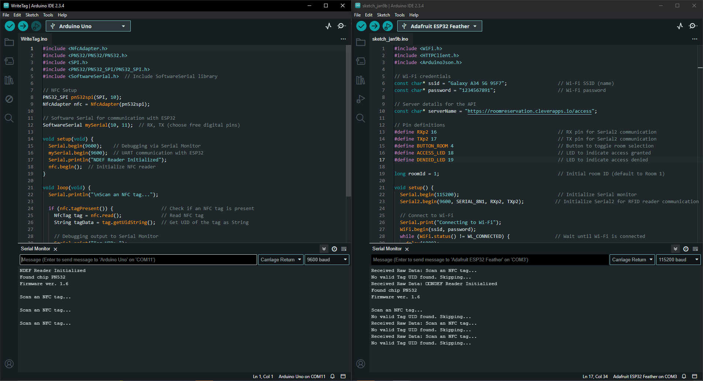
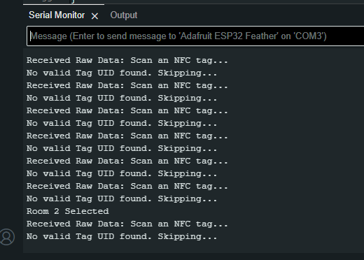
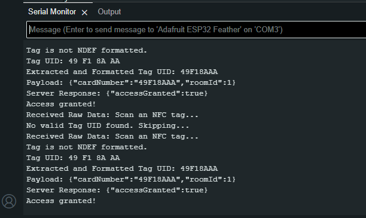
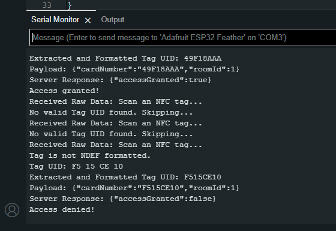

# Project Documentation

## Main Aim of the Project
The primary objective of this project is to develop an interactive embedded system that sends RFID reader data to a server via Wi-Fi for room booking purposes.

## Technical Aim of the Project
This project aims to create an interactive embedded system integrating **Arduino Uno**, **ESP32**, and **NFC technologies** for seamless communication and enhanced functionality. The project demonstrates:

- Communication between Arduino Uno and ESP32.
- NFC-based authentication or data exchange.
- Integration of LEDs and buttons for user interaction.
- Serial communication to monitor system states and test functionality.
- Room-based access control using a server API.

---

## Components
The project utilizes the following hardware components:

1. **Arduino Uno**
   - Acts as the primary microcontroller.
2. **ESP32**
   - Handles wireless communication and extended functionalities.
3. **NFC Module**
   - Reads and writes NFC tags/cards.
4. **LEDs**
   - Indicates system status (e.g., access granted, access denied).
5. **Push Buttons**
   - Facilitates user interaction for triggering specific actions.
6. **Power Supply**
   - Supplies the necessary voltage and current to components.
7. **Connecting Wires**
   - Establishes electrical connections between components.
8. **Resistors**
   - Limits current to LEDs to prevent damage.

---

## Main Libraries and Programs

### Required Libraries
Ensure the following libraries are installed in the Arduino IDE:

- **WiFi** (ESP32 Core Libraries): Provides Wi-Fi functionality for ESP32.
- **HTTPClient**: Handles HTTP requests to the server.
- **ArduinoJson**: Parses JSON responses from the API.
- **MFRC522**: Integrates the NFC module.
- **Wire**: Enables I2C communication.
- **SoftwareSerial**: Facilitates additional serial communication for Arduino Uno.

### Main Programs

The project uses the following Arduino sketches:

1. `WriteTag.ino`
   - Writes data to NFC tags/cards.
2. `sketch_jan9b.ino`
   - Acts as the primary control program, integrating:
     - Wi-Fi and API communication.
     - Room selection via button.
     - LED-based feedback for access validation.

---

## How to Assemble the Circuit

1. **Refer to Circuit Diagrams**
   - Use `Arduino_Uno_ESP32_Serial_Comm_circuit_schema.PNG` for connections between Arduino Uno and ESP32.
   - Use `full_circuit_schema.PNG` for the overall setup.
2. **Steps to Connect Components**
   - Connect the **NFC module** to Arduino Uno using SPI pins:
     Since the NFC module is an Arduino Uno shield, place it directly on top of the Arduino Uno as shown in this photo:

       

   - Connect ESP32 to Arduino Uno using SoftwareSerial pins:
     - Arduino Uno TX -> ESP32 RX
     - Arduino Uno RX -> ESP32 TX

     Since Arduino Uno operates at 5V and ESP32 at 3.3V, a voltage divider is needed for safe connection. Refer to the following image:

     

   - Connect LEDs:
    - For ACCESS_LED: 
       Connect the long leg (anode) of the LED to GPIO 18 (through a 220-ohm resistor).
       Connect the short leg (cathode) of the LED to the ground (GND) pin of the ESP32.
    - For DENIED_LED :
       Connect the long leg (anode) of the LED to GPIO 19 (through a 220-ohm resistor).
       Connect the short leg (cathode) of the LED to the ground (GND) pin of the ESP32.

        

   - Connect the **button** to pin 4 on ESP32. Example circuit:

     

   - Verify all power and ground connections.

   The final circuit schema is depicted below:

   

---

## How to Open the Project

1. Launch the Arduino IDE.
2. Load the required sketches:
   - `WriteTag.ino` for NFC card initialization.
   - `sketch_jan9b.ino` for the main application.
3. Verify the correct board and port are selected under **Tools > Board** and **Tools > Port**.
4. Change the Wifi network name and password to yours.
5. Verify the programs before upload.
6. See if there is missing packages.
7. upload the codes on its device.

You should see exactly this result: (please notice carefully the selected Boards and COM and baudrates and notice that both code are running together)
  
  

---

## How to Run and Test the Project

### Running the Project
1. **Upload Sketches**
   - First, upload `WriteTag.ino` to Arduino Uno for NFC card initialization.
   - Then, upload `sketch_jan9b.ino` for the main application.
2. **Power the Setup**
   - Use USB or an external power supply.
3. Open the **Serial Monitor** in Arduino IDE to debug and monitor system states.

### Testing
1. **Test NFC Functionality**
   - Place an NFC card near the NFC module and verify it is correctly read.
2. **Test Room Selection**
   - Press the room selection button and confirm the room ID updates in the Serial Monitor.
3. **Test Access Control**
   - Validate that the system sends an HTTP request to the server and:
     - **Access Granted**: Access LED lights up.
     - **Access Denied**: Denied LED lights up.
4. **Monitor Serial Outputs**
   - View logs in the Serial Monitor to ensure expected behavior.

---

## Expected Results

1. **NFC Module**
   - Successfully reads and writes to NFC tags.
2. **LED Indicators**
   - Illuminate based on access validation:
     - Green LED for access granted.
     - Red LED for access denied.
3. **Button Actions**
   - Toggles the selected room. On pressing the button, this response is expected:

     

4. **Wi-Fi and API Communication**
   - ESP32 connects to the specified Wi-Fi network.
   - Handles HTTP requests and responses accurately:
     - For access granted:

       

     - For access denied:

       

5. **Serial Communication**
   - Debugging logs display correctly for both sender (Arduino Uno) and receiver (ESP32).

---

### Notes
- Both the sender (Arduino Uno with NFC shield) and receiver (ESP32) must be powered using USB cables to ensure proper data transfer.
- Always upload the program to Arduino Uno first. Once uploaded, open a new sketch to upload the receiver code to ESP32.

---

## Troubleshooting

- **NFC Module Not Responding**
  - Verify SPI connections and ensure the NFC library is installed.

- **No Serial Output**
  - Confirm the correct baud rate is set in the Serial Monitor.

- **LEDs Not Working**
  - Check pin connections and resistor values.

- **ESP32 Issues**
  - Ensure proper connections to Arduino Uno.
  - Verify ESP32 firmware and drivers.
  - Confirm Wi-Fi credentials are accurate.

---

